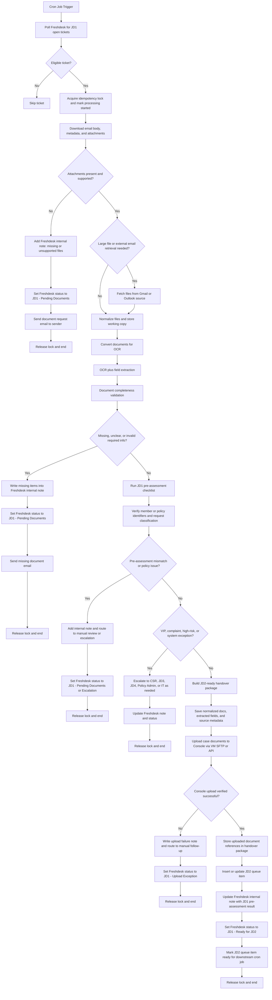

# JD1 Automation Flow Review

This draft keeps the automation within JD1 scope based on `STANDARD OPERATING PROCEDURE- JD1.docx`.

## Key Feedback Before Automation

1. JD1 should be a `pre-assessment and handover` flow, not a claim-entry flow.
   - JD1 owns email intake, attachment handling, completeness checks, and case readiness.
   - JD2 owns IAS claim preparation, submission, and revision.

2. Add a `ticket eligibility filter` before processing.
   - Poll only Freshdesk tickets that are open and assigned to the JD1 automation scope.
   - Exclude already-processed tickets, closed tickets, and tickets flagged for manual-only handling.

3. Add `idempotency and locking`.
   - A cron job can pick the same ticket more than once.
   - Use a processing lock plus a stable processing key such as Freshdesk ticket ID + latest updated timestamp.

4. Add a `manual escalation branch`.
   - JD1 SOP requires escalation for VIP, complaint, high-risk, policy-data issues, and system issues.
   - These should not continue through straight-through automation.

5. Keep `readiness verification` limited to pre-assessment scope.
   - JD1 can verify identifiers, required forms, and obvious policy/member mismatches needed to decide whether the case is handover-ready.
   - Detailed claim-entry validation belongs to JD2.

6. Add explicit handling for `unsupported or missing attachments`.
   - SOP says JD1 reviews all attached documents and may retrieve large files from Gmail or Outlook.
   - Automation should detect no files, unsupported files, or inaccessible files and reply accordingly.

7. Preserve `internal notes / audit trail`.
   - SOP says every case should record what was checked, what is missing or verified, and the next action.
   - This should be written into Freshdesk internal notes and your own processing log.

8. Make `Console upload via VM SFTP/API` the final JD1 success gate.
   - JD1 should upload the validated case documents into Console before handover.
   - If upload or verification fails, the case should not be marked ready for JD2.

9. End JD1 at a `JD2-ready handover package`.
   - JD1 should output normalized files, extracted metadata, uploaded document references, and a clear readiness state.
   - JD1 should not prepare claim lines, apply claim codes, or create IAS claim records.

## Proposed JD1 Mermaid Flow

## Boundary Notes

1. JD1 automation should stop at `JD2 queue ready`.
2. JD1 should decide `is this case complete and handover-ready?`
3. JD1 should upload documents into Console and verify upload success before handover.
4. Claim creation, amendment, claim coding, and IAS status changes belong to JD2.
5. Vitamin and supplement exclusion reasoning belongs to JD2.
6. If you want, the next step is to split this into:
   - `JD1 happy path`
   - `JD1 exception handling`
   - `JD1 to JD2 handover contract`
