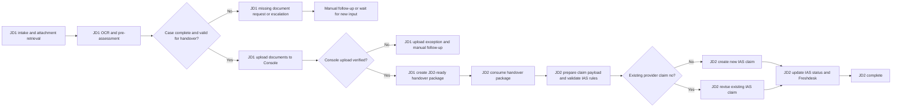

# JD1 to JD2 Automation Handover

This document defines the handover boundary between JD1 automation and JD2 automation.

It is intended for technical-lead review so the expected ownership, payload, and control points are clear before implementation.

## Purpose

JD1 and JD2 should not perform the same work.

The intended split is:

1. `JD1`
   - Intake the incoming Freshdesk or email case
   - Download and normalize attachments
   - Run OCR and initial field extraction
   - Perform pre-assessment and completeness checks
   - Request missing documents or escalate when needed
   - Upload validated documents into Console
   - Hand over a JD2-ready package

2. `JD2`
   - Consume only JD1-approved and JD1-uploaded cases
   - Validate the handover package for claim processing
   - Prepare IAS claim fields and line items
   - Create a new claim in IAS or revise an existing provider claim
   - Update IAS processing status and Freshdesk notes

## High-Level End-to-End Flow

## Handover Rule

JD1 may hand over a case to JD2 only when all of the following are true:

1. The incoming request has been classified into a supported claim-processing path.
2. Required attachments are present and readable.
3. OCR and first-pass extraction completed successfully.
4. Pre-assessment does not indicate a missing-document or escalation-only case.
5. Console upload completed successfully and the uploaded document references were captured.

If any of the above fails, the case should not enter JD2-ready state.

## Minimum JD1 Output to JD2

JD2 should receive a structured handover package rather than reprocessing the raw email thread from scratch.

Recommended minimum fields:

1. `freshdesk_ticket_id`
   - Primary case reference used across JD1 and JD2

2. `case_type`
   - For example `provider_claim`, `reimbursement_claim`, or another supported path

3. `jd1_status`
   - Example: `ready_for_jd2`

4. `handover_version`
   - Increment when JD1 reprocesses the same case due to updated attachments or new information

5. `received_at`
   - Original case received timestamp

6. `source_email_metadata`
   - Sender, subject, thread references, and other useful intake context

7. `normalized_document_paths`
   - Local or managed paths for the validated working copies produced by JD1

8. `ocr_result`
   - OCR JSON or a path/reference to the OCR output

9. `extracted_fields`
   - Key first-pass fields extracted by JD1, such as:
   - member identifiers
   - policy identifiers
   - provider name
   - treatment dates
   - invoice references
   - diagnosis text

10. `document_completeness_result`
    - What JD1 checked and whether the case passed pre-assessment completeness rules

11. `console_upload_refs`
    - Uploaded file IDs, paths, URLs, barcode tags, or equivalent Console references needed downstream

12. `existing_claim_no`
    - Present when JD1 or the upstream case already identifies an IAS claim number for provider-claim revision

13. `jd1_internal_notes_summary`
    - Short machine-readable or human-readable summary of what JD1 verified or flagged

## What JD2 Must Not Redo

To keep the boundary clean, JD2 should not redo the full JD1 pipeline.

JD2 should not be responsible for:

1. Polling raw intake tickets that are not JD2-ready
2. Re-downloading original email attachments as the default path
3. Re-running full-document OCR for every case
4. Repeating missing-document outreach as the primary intake workflow
5. Uploading documents into Console for the first time

JD2 may still perform targeted validation when needed, but it should treat JD1 output as the primary input.

## What JD2 Must Decide

After receiving the handover package, JD2 should answer these questions:

1. Is the handover package complete enough for claim processing?
2. Do coverage and NOC checks allow claim processing to continue?
3. Does the case require a new IAS claim or a revision to an existing provider claim?
4. Are the claim lines, amounts, coding, and exclusions valid for IAS submission?
5. Did IAS submission or amendment complete successfully?

## Control Points

For technical design review, these are the main control points between JD1 and JD2:

1. `JD1 ready gate`
   - Case is not passed to JD2 until OCR, pre-assessment, and Console upload all succeed

2. `Handover versioning`
   - JD2 should know whether it is processing the latest JD1-approved version of the case

3. `Duplicate prevention`
   - JD1 should not generate duplicate JD2-ready handovers for the same unchanged case
   - JD2 should not submit the same handover version to IAS more than once

4. `Manual exception routing`
   - Missing documents, escalation cases, upload exceptions, and contradictory handover data should stop straight-through automation

5. `Create vs revise decision`
   - Existing trusted claim number means JD2 should follow provider revision logic
   - No existing claim number means JD2 should follow new claim creation logic

## Suggested Status Model

At a minimum, the end-to-end flow should distinguish these statuses:

1. `JD1 - Pending Documents`
2. `JD1 - Escalation`
3. `JD1 - Upload Exception`
4. `JD1 - Ready for JD2`
5. `JD2 - Processing`
6. `JD2 - Manual Review`
7. `JD2 - Completed`

## Recommendation

For implementation, treat `JD1 -> JD2 handover` as a formal contract, not just an informal status change.

That contract should include:

1. A stable case ID
2. A handover version
3. OCR and extracted field outputs
4. Console upload references
5. A clear create-vs-revise hint when known
6. A JD1 decision that the case is ready for JD2 processing
