# JD2 Automation Flow Review

This draft keeps the automation within JD2 scope based on `JD2 SOPs v20250109 (Details) version 1.pdf`.

The primary cron-job objective here is:

1. Submit a new claim to IAS when the JD2 input is ready for straight-through processing.
2. Revise an existing provider claim in IAS when the case already has a claim number.

## Key Feedback Before Automation

1. JD2 should start only after `JD1 pre-assessment handover`.
   - JD2 should consume a JD1-approved case package instead of redoing full intake.
   - JD2 owns claim preparation and IAS record creation or amendment.

2. Split the JD2 cron job into `new submission` and `claim revision` paths.
   - The SOP has a normal member claim flow and a provider flow that starts by searching an existing claim number in IAS.
   - These should not be forced through one payload path because the required IAS fields differ.

3. Add a `JD2 readiness filter` before any IAS submission call.
   - Poll only cases already handed over by JD1 and marked ready for JD2 processing.
   - Exclude tickets already processed, closed, or manually locked for review.

4. Add `idempotency and processing lock` at the case level.
   - The cron job must not submit or amend the same case twice.
   - Use a stable key such as Freshdesk ticket ID + JD2 queue item ID + latest handover version.

5. Treat `JD1 handover validation` as the entry gate.
   - JD2 should confirm that the handover package is complete enough for claim preparation, including Console-uploaded document references.
   - If the handover payload is incomplete or contradictory, route back for manual review instead of re-running intake.

6. Keep `coverage and NOC validation` as a separate IAS decision gate.
   - The SOP explicitly requires checking coverage and NOC before completing claim entry.
   - Failed checks should route to manual review or document request, not silent API submission.

7. Treat `vitamins and supplements exclusion reasoning` as JD2-only logic.
   - The SOP explicitly places GPT-assisted exclusion checking in JD2.
   - This should be isolated as a line-item review step and should not block non-related claim lines.

8. Preserve `line-by-line claim construction`.
   - The SOP requires split processing for different treatment dates and separate lines for room, surgeon, anesthesia, and excluded items.
   - The automation should build structured claim items one line at a time before calling IAS.

9. Make `provider revision` an amendment flow, not a new-claim flow.
   - For provider cases with an existing claim, the SOP says to search by claim number, amend the record, and use `IAER - Input Error` as the amendment instruction.
   - The cron job should not create a duplicate claim when a valid claim number already exists.

10. Treat `payment tab completion and status transition` as post-submission gates.
   - The SOP requires bank info verification, payment currency/rate consistency, save, claim number generation where applicable, and status update to `RA` or `PV (Singlife)`.
   - The cron job should only mark the case completed after those actions succeed.

11. Preserve `audit trail and outward communication`.
   - Freshdesk notes should record what was verified, what was submitted, whether it was a new submission or amendment, and the IAS response or failure reason.

## Proposed JD2 Mermaid Flow

```mermaid
flowchart TD
    A[Cron Job Trigger] --> B[Poll JD2-ready queue and Freshdesk cases]
    B --> C{Eligible JD2 case?}
    C -- No --> Z1[Skip case]
    C -- Yes --> D[Acquire idempotency lock and mark JD2 processing started]

    D --> E[Load JD1 handover package, extracted fields, normalized documents, and Console upload references]
    E --> F{JD1 handover package complete and consistent?}

    F -- No --> G[Write internal note and route to manual review]
    G --> H[Set JD2 status to handover exception]
    H --> Z2[Release lock and end]

    F -- Yes --> I[Run JD2 claim-entry validation]
    I --> J[Validate treatment date, diagnosis, invoice refs, provider/member identifiers]
    J --> K[Run IAS coverage and NOC checks]
    K --> L{Coverage, policy, or NOC issue?}

    L -- Yes --> M[Write internal note and route to manual escalation]
    M --> N[Set JD2 status to escalation or pending review]
    N --> Z3[Release lock and end]

    L -- No --> O[Build line-level claim structure]
    O --> P[Split lines by treatment date and fee category]
    P --> Q[Run vitamins and supplements exclusion checks for relevant lines]
    Q --> R[Apply suspend, reject, remark, and CSR remark logic]
    R --> S{Existing IAS claim number for provider case?}

    S -- No --> T[Prepare IAS new claim submission payload]
    T --> U[Call IAS claim submission API]
    U --> V{IAS new claim submission successful?}

    S -- Yes --> W[Load existing IAS claim context]
    W --> X[Prepare amendment payload for provider revision]
    X --> Y[Set amendment instruction to IAER - Input Error]
    Y --> Z[Call IAS amendment or revision API path]
    Z --> AA{IAS claim revision successful?}

    V -- No --> AB[Write failure note with IAS response]
    AB --> AC[Set status to JD2 manual follow-up]
    AC --> Z4[Release lock and end]

    AA -- No --> AD[Write amendment failure note with IAS response]
    AD --> AE[Set status to JD2 manual follow-up]
    AE --> Z5[Release lock and end]

    V -- Yes --> AF[Verify IAS claim number and returned identifiers]
    AA -- Yes --> AF

    AF --> AG[Complete payment and settlement fields]
    AG --> AH[Validate bank info, email, payment currency, and exchange rate]
    AH --> AI[Save IAS transaction state]
    AI --> AJ[Update IAS claim status to RA or PV based on workflow]
    AJ --> AK{Post-submission status update successful?}

    AK -- No --> AL[Write status update failure note]
    AL --> AM[Set case to JD2 manual review]
    AM --> Z6[Release lock and end]

    AK -- Yes --> AN[Update Freshdesk properties and internal note]
    AN --> AO[Record claim number, submission mode, and audit details]
    AO --> AP[Mark JD2 case completed]
    AP --> Z7[Release lock and end]
```

## Boundary Notes

1. JD2 automation should start only after `JD1-ready handover`.
2. JD2 should own `claim payload preparation`, `IAS submission or amendment`, and `post-submission status handling`.
3. `Document request workflow` should remain primarily on the JD1 side unless JD2 detects a post-handover exception.
4. `Provider revision` should be triggered only when the case already has a trusted IAS claim number.
5. If the existing claim number is missing, conflicting, or not retrievable from IAS, the case should stop for manual review instead of creating a replacement claim.
6. The exact API split for `new claim` versus `revision/amendment` should follow the IAS integration contract implemented in code.

## Suggested Next Split

If you want, the next step is to break this into:

1. `JD2 new-claim happy path`
2. `JD2 provider-revision path`
3. `JD2 escalation and document-request exceptions`
4. `JD2 to IAS API contract fields`
